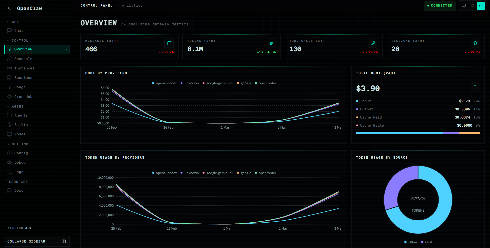
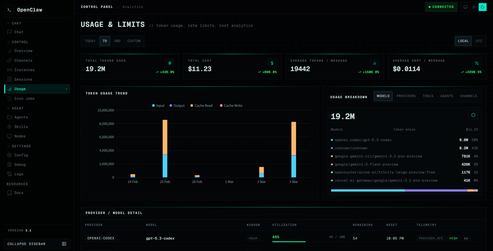
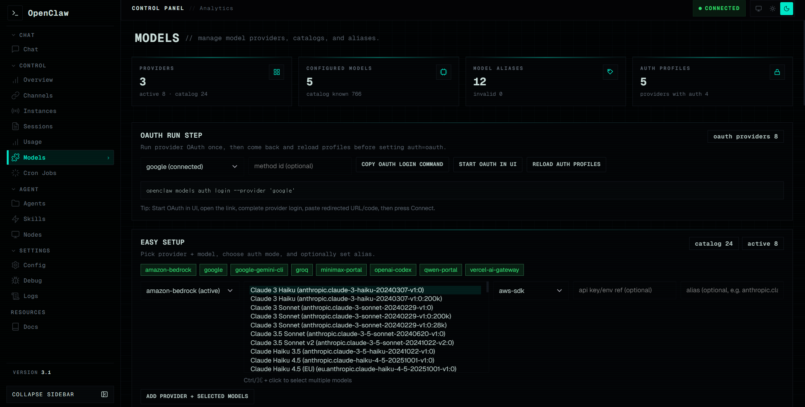

# OpenClaw UI

A custom Control UI package for OpenClaw.

Primary repository:
- <https://github.com/Paul-JSN/OpenClawUI>

---

## 1) Browser Support

### Recommended
- **Google Chrome (latest stable)**

### Known Issue
- **Microsoft Edge** can render different typography/spacing (font metrics and sizing can look off compared to Chrome).
- Until that is fully normalized, Chrome is the reference browser.

---

## 2) What This Fork Adds (UI-side)

This fork contains UI features and UX improvements that may not exist in upstream OpenClaw UI builds yet.

Examples:
- Enhanced Models page workflows
  - provider-focused management UI
  - alias/reference visibility improvements
  - in-UI OAuth guidance flow
- Better removal controls for provider refs/model refs
- More consistent control styling (inputs/selects/buttons)
- Agents tab selected-state styling aligned with Usage segmented controls

> Notes
> - These are primarily **frontend UX features**.
> - They do not require inventing non-existent OpenClaw gateway APIs.

---

## 3) Quick Start

### Prerequisites
- Node.js 20+
- npm 10+

### Install and build
```bash
git clone https://github.com/Paul-JSN/OpenClawUI.git
cd OpenClawUI
npm ci
npm run build
```

### Local dev server
```bash
npm run dev -- --host
```

---

## 4) Backup First (Required)

Before install/update, back up your current UI.

### Windows PowerShell example
```powershell
$src = "C:\path\to\openclaw\ui"
$dst = "C:\path\to\backups\openclaw-ui-$(Get-Date -Format yyyyMMdd-HHmmss).zip"
Compress-Archive -Path $src -DestinationPath $dst
```

---

## 5) Pin Custom UI After `openclaw update`

OpenClaw updates can replace served UI assets unless `gateway.controlUi.root` is pinned.

### Recommended one-command flow
```bash
./scripts/reapply-openclaw-ui.sh
```

What it does:
1. build this UI (`npm ci && npm run build`)
2. set `gateway.controlUi.root` in `~/.openclaw/openclaw.json`
3. restart gateway

Default target root:
- `<repo-parent>/dist/control-ui`

Optional overrides:
- `OPENCLAW_CONTROL_UI_DIST=/absolute/path/to/dist/control-ui`
- `OPENCLAW_CONFIG_PATH=/absolute/path/to/openclaw.json`

---

## 6) Update Workflow (Recommended)

```bash
openclaw update
/path/to/OpenClawUI/scripts/reapply-openclaw-ui.sh
```

Example alias:
```bash
alias openclaw-update-ui='openclaw update && /path/to/OpenClawUI/scripts/reapply-openclaw-ui.sh'
```

---

## 7) Security Baseline

- Dependency vulnerability checks:
  ```bash
  npm audit
  ```
- Production build currently disables source maps (`vite.config.ts`)
- `.env` patterns are ignored via `.gitignore`
- Security reporting process: see [SECURITY.md](./SECURITY.md)

---

## 8) Screenshots

Current UI captures:

### DB1 — Overview


### DB2 — Usage


### DB3 — Models


---

## 9) License

This project is released under the [MIT License](./LICENSE).

---

## 10) OpenClaw Install Prompt (Agent Automation)

```text
Install this UI into my OpenClaw instance.

Source repo:
https://github.com/Paul-JSN/OpenClawUI

Target OpenClaw path:
<YOUR_OPENCLAW_ROOT>

Requirements:
1) BACKUP first before changing anything.
2) Replace ONLY UI files with this repo contents.
3) Run build.
4) Pin gateway.controlUi.root to the built dist/control-ui path.
5) Restart gateway.
6) Show exact command output/logs.
```
